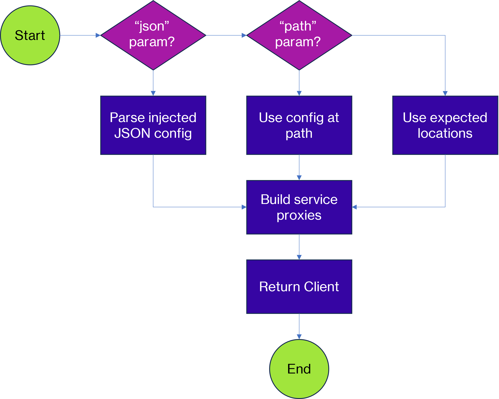

# Do Not Use #
This code has been **deprecated** in favour of the FERN generated SDKs for Python and Typescript:

* [TypeScript-SDK](https://github.com/vectara/typescript-sdk) 
* [Python-SDK](https://github.com/vectara/python-sdk)

# vectara-skunk-client (Deprecated)
A Python SDK for Vectara written by the field to help you add GenerativeAI to your applications
without needing to hire a Data Scientist. It helps you work with a Corpus and add documents
to your Retrieval Augmented Generation (RAG) pipeline.

## Getting Started

1. Generate either an API Key or OAuth2 App from within Vectara's console.
2. Put these into a configuration ".vec_auth.yaml" in your home directory.
3. Install library `vectara-skunk-client` with pip
4. Invoke vectara.core.Factory.build() which will load the default authentication profile.
5. Build awesome GenerativeAI applications.

```bash
pip install vectara-skunk-client
```

```python
from vectara_client.core import Factory

client = Factory().build()
# Upload our document
client.indexer_service.upload(path="./santas_workshop_info.pdf", corpus_id=1)
# Run query
client.query_service.query("Where does Santa live?")

```

## Accessing Vectara Services
Once you have created your client, the Vectara services may be accessed like so:
```python
# Admin Service
admin = client.admin_service
# Indexer Service
indexer = client.indexer_service
# Query API
query = client.query_service
# Document Service
doc_service = client.document_service

```
## Factory Build Configuration Flow

The factory can use multiple options to load the configuration which are given below 
when `Factory().build(...)` is invoked.:

1. Param `config_path`: If a config path is specified this is used:
   1. If this is a file it will be read
   2. If this is a directory, we will look at `${config_path}/.vec_auth.yaml`
2. Param `config_json`: If a JSON configuration is passed in then this will be used.
3. If neither has been specified, we will look in the users home directory



### Home Location
The factory by default will automatically seek configuration in the following locations:
* On Linux based systems from within $HOME/.vec_auth.yaml
* On Windows based systems from within %USERHOME%\\.vec_auth.yaml

### Configuration Format
The configuration format should like below. You can define multiple configuration blocks. If not specified,
the factory will load the profile "default". You must specify your customer_id but may 

```yaml
default:
  customer_id : "1999999999"
  auth:
    # For API Key, you only need the API key
    api_key : "abcdabcdabcdabcdabcdabcdababcdabcd"
admin:
  customer_id : "1999999999" # Customer Id as a string
  auth:
    # For OAuth2, you need app_client_id, app_client_secret, auth_url
    app_client_id : "abcdabcdabcdabcdabcdabcdab"
    app_client_secret : "abcdabcdabcdabcdabcdabcdababcdabcdabcdabcdabcdabcdab"
    # This is optional, you can leave this blank in most circumstances
    auth_url : "https://vectara-prod-YOUR_CUSTOMER_ID.auth.us-west-2.amazoncognito.com/oauth2/token"
```

### Multiple Profiles
You can load other configuration profiles using the property profile on the build command.

```python
from vectara_client.core import Factory

factory = Factory()
client = factory.build(profile="admin")

```

### Dynamic Configuration
You can also inject the configuration for the client by putting in a JSON string of the following formats

```python
from vectara_client.core import Factory

auth_config_json = "{...}"
client = Factory().build(config=auth_config_json)
```

#### JSON API Key
```json
{
   "client_id": "1999999999",
   "auth": {
      "api_key": "abcdabcdabcdabcdabcdabcdababcdabcd"
   }
}
```
#### JSON API Key
```json
{
   "client_id": "1999999999",
   "auth": {
      "api_key": "abcdabcdabcdabcdabcdabcdababcdabcd"
   }
}
```


## Get Help
This is in no way a supported part of the Vectara stack though
depending on goodwill between client and the account team, we'll look into issues on your behalf
without strict SLA's. Offers of coffee may help accelerate this, or if virtual, some pleasant
conversation:-)

## Why "skunk-client"?
It's called the "skunk" client in honor of Lockheed Martin's Skunkworks advanced projects division.
This code is designed to be made in line with the following principals:

1. Creating smaller experiments to get feedback rapidly -> we can prove out concepts quickly and
   pass this onto internal engineers.
2. Relative autonomy: This is designed to be helpful to clients but likely won't have as much rigour
   as features developed internally. Sometimes the best way to demonstrate a new capability is with
   working code.
3. Immediately apply feedback and improve!!

Also, technically I'm not employed in an engineering role so lets keep this on the down-low.

## TODOs
List of todos
* Switch PDF to Amin's useQA paper and "Attention is all you need" paper.
* Split out Manager into separate repository that uses this as a client
* Build Sandbox environments demo.
* Rework the authentication (use default locations)
* Write getting started for the authentication
* Refactor HTTP request into utility
* Tune down logging for OAuthUtil to DEBUG
* Add a documentation site
* Add QueryService
